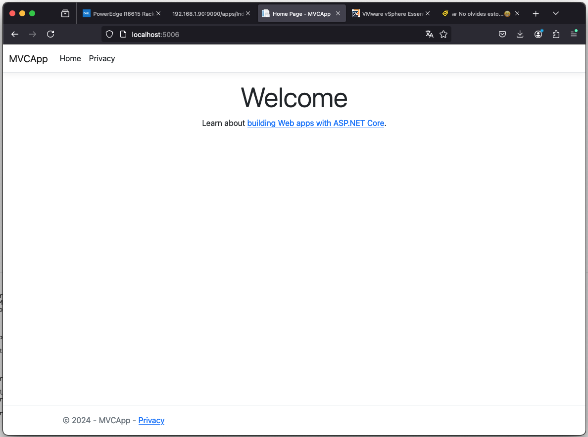

## Visual Studio Code

### MVC

[ NET on MacOS - Creating ASP.NET Core MVC App with VS Code](https://www.youtube.com/watch?v=HIfhAqaHq2A)


```
dotnet new mvc -o MVCApp

The template "ASP.NET Core Web App (Model-View-Controller)" was created successfully.
This template contains technologies from parties other than Microsoft, see https://aka.ms/aspnetcore/8.0-third-party-notices for details.

Processing post-creation actions...
Restoring /Users/dav-29/MisDocumentos/GitRepositorios/VisualStudioCode/VisualStudio-CSharp/01_Project-MVC/MVCApp/MVCApp.csproj:
  Determining projects to restore...
  Restored /Users/dav-29/MisDocumentos/GitRepositorios/VisualStudioCode/VisualStudio-CSharp/01_Project-MVC/MVCApp/MVCApp.csproj (in 91 ms).
Restore succeeded.
```

```
cd MVCApp

dotnet build

Determining projects to restore...
  All projects are up-to-date for restore.
  MVCApp -> /Users/dav-29/MisDocumentos/GitRepositorios/VisualStudioCode/VisualStudio-CSharp/01_Project-MVC/MVCApp/bin/Debug/net8.0/MVCApp.dll

Build succeeded.
    0 Warning(s)
    0 Error(s)

Time Elapsed 00:00:06.07
```

```
dotnet run

Building...
warn: Microsoft.AspNetCore.DataProtection.KeyManagement.XmlKeyManager[35]
      No XML encryptor configured. Key {5ea5fb0d-291c-48d2-8cf5-fa945fae32c0} may be persisted to storage in unencrypted form.
info: Microsoft.Hosting.Lifetime[14]
      Now listening on: http://localhost:5006
info: Microsoft.Hosting.Lifetime[0]
      Application started. Press Ctrl+C to shut down.
info: Microsoft.Hosting.Lifetime[0]
      Hosting environment: Development
info: Microsoft.Hosting.Lifetime[0]
      Content root path: /Users/dav-29/MisDocumentos/GitRepositorios/VisualStudioCode/VisualStudio-CSharp/01_Project-MVC/MVCApp
warn: Microsoft.AspNetCore.HttpsPolicy.HttpsRedirectionMiddleware[3]
      Failed to determine the https port for redirect.
```

#### Now listening on: http://localhost:5006
      
<center>
	
</center>