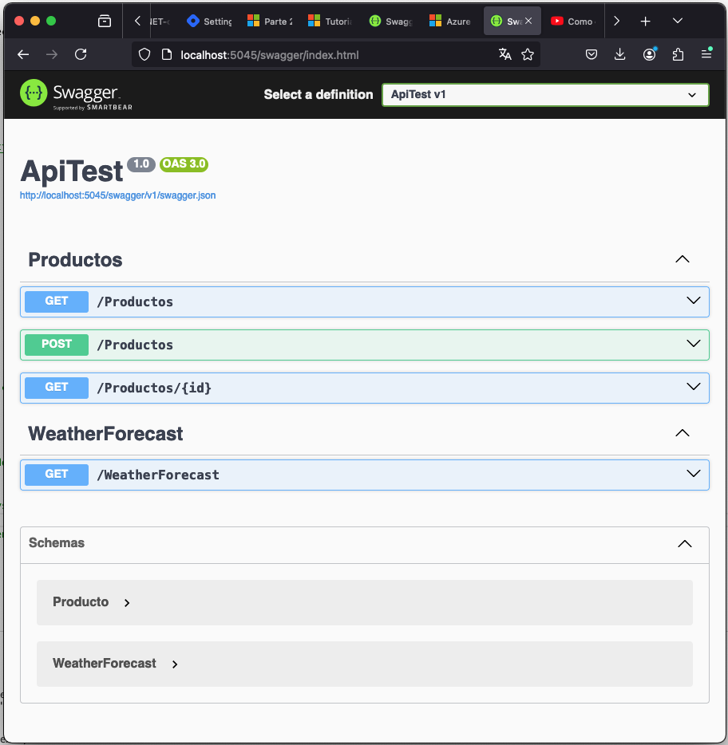

## Visual Studio Code

### Swagger

<center>
	
</center>

```
dotnet new webapi -o ApiTest

cd ApiTest

dotnet build

dotnet run
```

```
http://localhost:5045/weatherforecast

http://localhost:5045/swagger/index.html
```

<center>
	
</center>

https://www.youtube.com/watch?v=HU-TZfGO-Do
https://github.com/ersindevrim/.Net-Core-Web-Api-Example-With-PostgreSql
https://github.com/abhishekbhave26/.NET-core-Applications/tree/master/Weather-Forecast-React-ASPNET-App


### API Rest

[Como crear una Web API REST en C# usando NET 7 y VSCode](https://www.youtube.com/watch?v=uu3wtI0IH1E)

#### ApiTest.csproj

```
dotnet add package Microsoft.EntityFrameworkCore

dotnet add package Microsoft.EntityFrameworkCore.Design

dotnet add package Microsoft.EntityFrameworkCore.SqLite

dotnet add package Npgsql.EntityFrameworkCore.PostgreSQL

dotnet add package NpgSql.EntityFrameworkCore.PostgreSQL.Design

dotnet tool install --global dotnet-ef
```

appsettings.json

```
{
  "Logging": {
    "LogLevel": {
      "Default": "Information",
      "Microsoft.AspNetCore": "Warning"
    }
  },
  "AllowedHosts": "*",
  "ConnectionStrings": {
    "PostgreSQLConnection": "Host=192.168.1.90;Port=5432;Username=Administrador;Password=admin1234;Database=DBCONTROL;",
    "DefaultConnection": "Data Source=DataApi.db"
  }
}
```

Program.cs

```
var connectionString = builder.Configuration.GetConnectionString("DefaultConnection");

builder.Services.AddDbContext<DataContext>(
    option => option.UseSqlite(connectionString)
);
```

Generar Base de Datos

```
dotnet ef migrations add MigracionInicial
dotnet ef database update
dotnet ef migrations remove
```

<center>
	
</center>