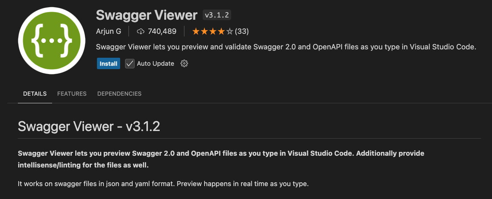
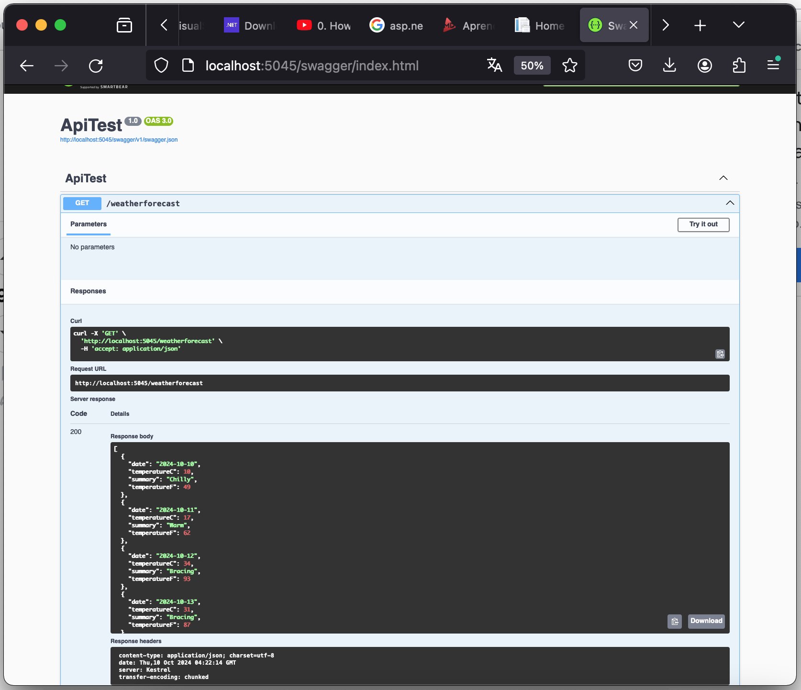

## Visual Studio Code

### Swagger

<center>
	
</center>

```
dotnet new webapi -o ApiTest

cd ApiTest

dotnet build

dotnet run
```

```
http://localhost:5045/weatherforecast

http://localhost:5045/swagger/index.html
```

<center>
	
</center>

https://www.youtube.com/watch?v=HU-TZfGO-Do
https://github.com/ersindevrim/.Net-Core-Web-Api-Example-With-PostgreSql
https://github.com/abhishekbhave26/.NET-core-Applications/tree/master/Weather-Forecast-React-ASPNET-App


### Update App

[Como crear una Web API REST en C# usando NET 7 y VSCode](https://www.youtube.com/watch?v=uu3wtI0IH1E)